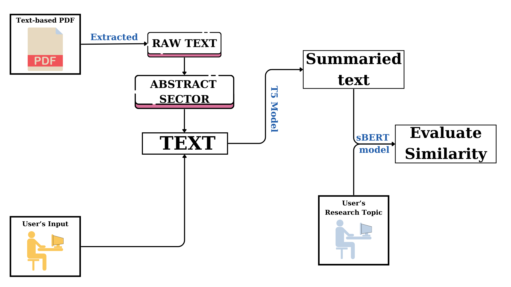
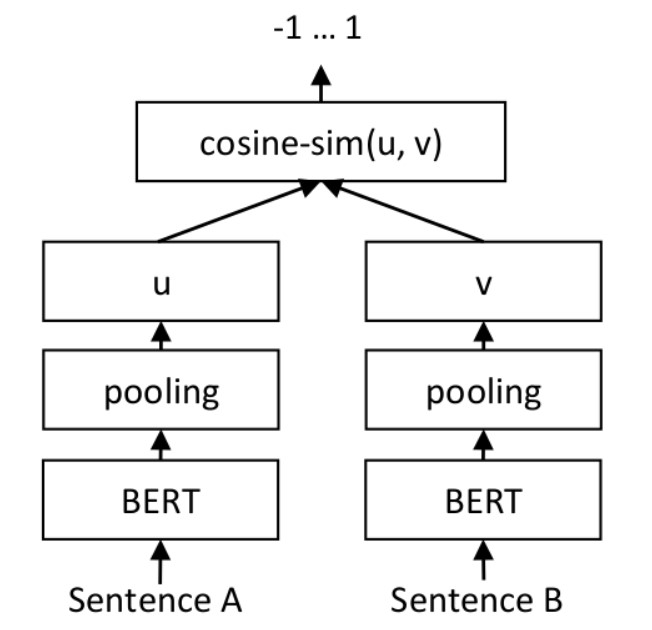

# Efficient Research Exploration: AI-Based Article Assessment and Summarization
> This is my solution for 3 days Take-home Challenge of Delta Cognition
---
## 1. Introduction

**1.1. Introduction:** You are an explorer who is constantly seeking out fresh information. As a scientist, you always learn about new issues through scientific study. But have you ever taken too long to decide whether you should read a certain article? Have you ever spent a lot of time reading an article only to discover that it didn't initially cover the topics you were interested in? Knowing this, I've brought a tool to make it easier for you to read the research. **We give you a way to summarize articles in a variety of ways and let you know whether or not you actually need to read this post**. Let's embark on this exploration and put this tool to the test.

**1.2. Work Flow:**

	
_Figure 1.1: Workflow of the project_

In this project, my objective is to gather source material in the form of articles and scientific publications. The system will have the capability to extract data, particularly the abstracts, from both PDF documents and user-provided text inputs. Subsequently, this data will be subjected to summarization using the **T5 model**. Moreover, users will have the option to specify their research interests to the system. The system will employ the **sBERT model** to evaluate the similarity between the research topics and the summarized articles. Based on this evaluation, the system will provide recommendations on whether it is worthwhile for users to read a particular article or not.

**T5 model**: A comprehensive tutorial for implementing T5 model can be found [here](https://huggingface.co/docs/transformers/model_doc/t5)

**sBERT**: To evaluating similarity between 2 sentences, I define an architechture as show below .For each sentence pair, I pass sentence A and sentence B through my network which yields the embeddings u und v. The similarity of these embeddings is computed using cosine similarity and the result is compared to the gold similarity score. For BERT layer, I load a pre-trained SentenceTransformer models _'bert-base-uncased'_ from [HuggingFace](https://huggingface.co/models?library=sentence-transformers). A pooling layer, average all contextualized word embeddings BERT is giving us, gives a fixed 768 dimensional output vector independent how long the input text was. Finally, I add on top of the pooling layer a fully connected dense layer with Tanh activation, which performs a down-project to 256 dimensions. Due to the time limitation, I can not prepare my own dataset, so I used a [STS benchmark dataset](http://ixa2.si.ehu.eus/stswiki/index.php/STSbenchmark) for training model(I used T4 GPU on [colab](https://drive.google.com/drive/folders/1wkGznUktqriUaK4_9d8U-6l7kDH4raMS?usp=sharing) to train). 

	

_Figure 1.2: sBERT architechture_

## 2. Set up for python

Install Python [(Setup instructions)](https://wiki.python.org/moin/BeginnersGuide)

**2.1. Create virtual environment**

If python's version is older than 3.3
```
pip install virtualenv
```
Create {env} virtual environment
```
python -m venv {env}
```

Activate virtual environment:
* Windows:
```
.\{env}\Scripts\activate
```
* macOS and Linux:
```
source {env}/bin/activate
```

**2.2. Install necessary libraries**

```
pip install -r api\requirements.txt
```

**2.3. Download a summarized model**

```
python saved_models\download_models.py
```

## 3. Running API

```
python api\main.py
```

## 4. Running the Frontend

## References
[1] Raffel, C., Shazeer, N., Roberts, A., Lee, K., Narang, S., Matena, M., Zhou, Y., Li, W. and Liu, P. J. Raffel, C., Shazeer, N., Roberts, A., Lee, K., Narang, S., & Matena, M. et al. (2019). Exploring the Limits of Transfer Learning with a Unified Text-to-Text Transformer. Retrieved 1 September 2023, from https://arxiv.org/abs/1910.10683v3

[2] Reimers, N. and Gurevych, I. Reimers, N., & Gurevych, I. (2019). Sentence-BERT: Sentence Embeddings using Siamese BERT-Networks. Retrieved 1 September 2023, from https://arxiv.org/abs/1908.10084
